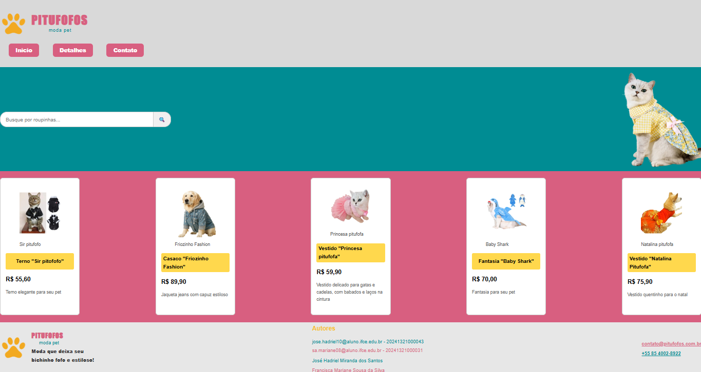
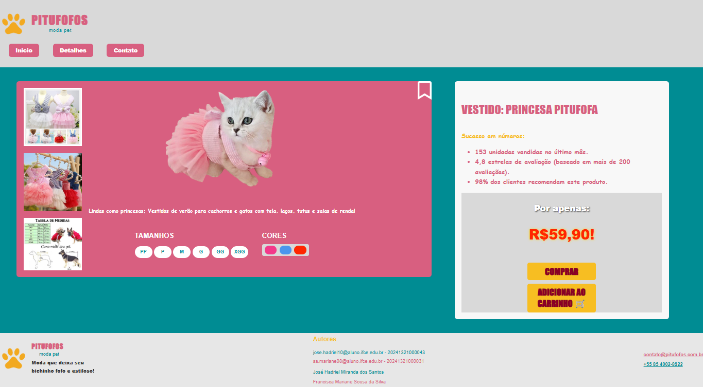
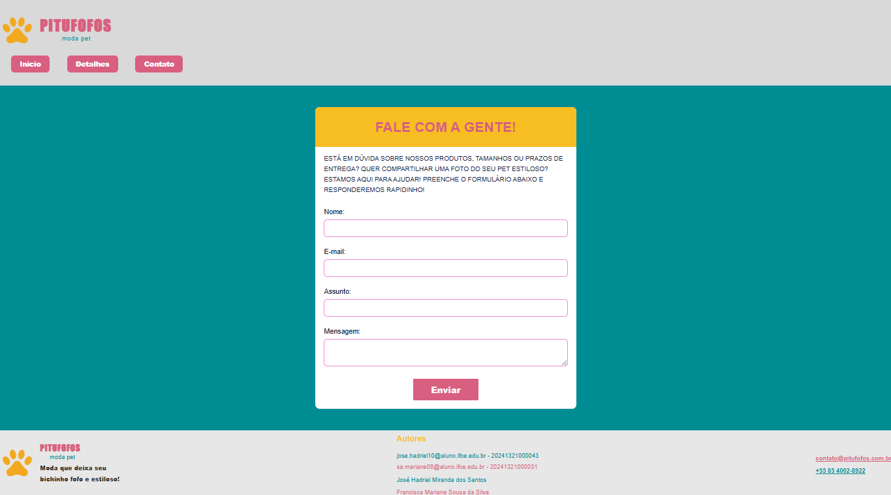

# 🐾 Pitufofos – Moda Pet  
### Projeto Final – Desenvolvimento Web I  

---

## 📌 Descrição do Projeto

Este repositório contém o projeto final da disciplina **Desenvolvimento Web I** lecionada pelo professor Thomaz Maia, onde o objetivo foi transformar um protótipo criado no **Figma** em um site funcional utilizando apenas **HTML e CSS**.

O site **Pitufofos – Moda Pet** apresenta uma coleção adorável de roupinhas para pets, seguindo um visual fofinho, colorido e confortável — tudo planejado previamente no protótipo do Figma.

---

# 🐾 Acesse o Site Oficial — PituFofos Moda Pet 💜✨
 
Clique no link abaixo para visitar o site no GitHub Pages:

🎀 **GitHub Pages:**  
👉 [🌟 Acessar o site PituFofos! 🌟](https://maryaanee.github.io/Projeto-Final-Web1/)

🐶🐱💖

---

# 🖼 Prints do Protótipo (Figma)

### • Página de Início – Figma  

### • Página de Detalhes – Figma  

### • Página de Contato – Figma  

---

# 💻 Prints do Site Final

### • Página Inicial

### • Página de Detalhes

### • Página de Contato

---

# 🔍 Comparação: Figma x Site Final

Observação: A proporção dos elementos nas capturas do site final pode parecer diferente devido ao tamanho do monitor e ao uso de zoom reduzido para que toda a página apareça em um único print.

## ✔ Semelhanças
- Paleta de cores fiel ao protótipo.
- Estrutura das páginas mantida.
- Layout responsivo básico.
- Navegação e organização semelhantes ao Figma.

---

## ✏ Diferenças Principais

- Fontes de texto, não achamos igual.
- pequenas modificações no desing, para deixar mais bonito/limpo.
- botões do cabeçalho e alguns outros

### 🏠 Página Inicial
- Ajustes leves de espaçamento.
- Fontes e botões com pequenas variações.
- Cards não ficaram 100% idênticos, mas preservam o estilo.
- Efeito de hover reproduzido parcialmente (representado pelo card  central amarelo no desing do Figma).
- Barra de pesquisa e elementos reposicionados para responsividade.

### 👗 Página de Detalhes
- Ícone de salvar estilizado.
- Fundo atrás da imagem principal removido.
- Box de preço reorganizada.

### 📩 Página de Contato
- Layout ajustado.
- Botão enviar modificado.
- Campo "Assunto" adicionado.
- Campos reorganizados e texto das labels foram colocados fora do label para melhor leitura e desing.

# 👩‍💻 Dupla/Autores

- **Francisca Mariane Sousa da Silva**  
- **José Hadriel Miranda dos Santos**  
📅 **Ano: 2025.2**

---

  ✨🐶 *Pitufofos – Moda Pet: estilo e fofura para o seu melhor amigo!* 🐾✨

